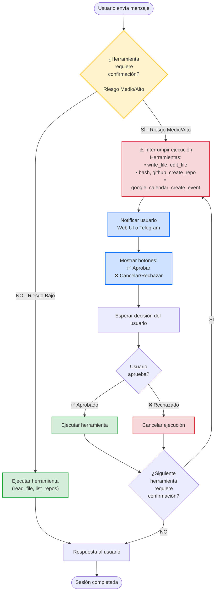
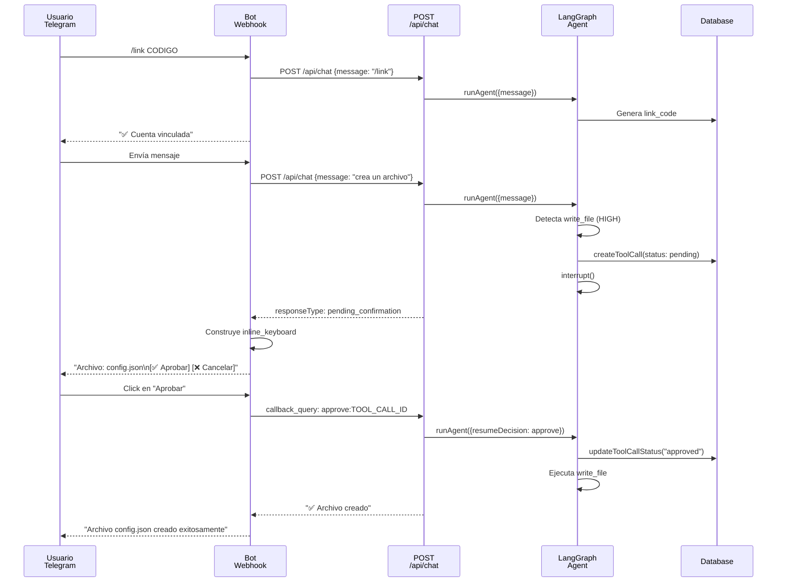

# Diagrama de Flujo: Human in the Loop (HITL)

Visualización del proceso de interrupción de decisiones de riesgo alto y medio en el sistema de agentes, mostrando cómo el usuario aprueba o rechaza acciones peligrosas a través de Web o Telegram.

## Diagrama Principal



---

## Leyenda de Colores

| Color | Significado | Ejemplo |
|-------|-------------|---------|
| 🟨 **Amarillo** | Punto de decisión | "¿Requiere confirmación?" |
| 🔴 **Rojo** | Interrupción/Rechazo | Interrupción de ejecución, cancelación |
| 🟢 **Verde** | Ejecución directa o aprobada | Ejecutar herramienta |
| 🔵 **Azul** | Notificación al usuario | Mostrar botones, notificar |

---

## Estados del Flujo

### 1. Detección (Decisión Inicial)
**Punto de decisión**: `¿Herramienta requiere confirmación?`

El sistema evalúa el nivel de riesgo de la herramienta que el agente intenta ejecutar.

| Nivel | Riesgo | Requiere HITL | Ejemplos |
|-------|--------|---------------|----------|
| **LOW** | Bajo | ❌ No | `get_user_preferences`, `list_enabled_tools`, `github_list_repos`, `read_file` |
| **MEDIUM** | Medio | ✅ Sí | `github_create_issue`, `github_create_repo`, `google_calendar_create_event`, `schedule_task` |
| **HIGH** | Alto | ✅ Sí | `write_file`, `edit_file`, `bash` |

**Implementación**: `packages/types/src/catalog.ts` → `getToolRisk()` y `toolRequiresConfirmation()`

---

### 2. Ejecución Directa (Sin Confirmación)
**Camino**: Herramientas de riesgo bajo

Cuando la herramienta NO requiere confirmación:
1. Se ejecuta inmediatamente
2. El resultado se envía al usuario
3. La sesión continúa

---

### 3. Interrupción
**Camino**: Herramientas de riesgo medio/alto

Cuando la herramienta requiere confirmación:
1. **Pausa la ejecución**: `LangGraph.interrupt()` detiene el grafo de ejecución
2. **Crea registro en DB**: Se guarda en tabla `tool_calls` con estado `pending_confirmation`
3. **Prepara notificación**: Se construye un mensaje personalizado con detalles de la acción

**Implementación**: 
- `packages/agent/src/graph.ts` → línea 362-395 (lógica de interrupt)
- `packages/db/src/queries/tool-calls.ts` → `createToolCall()`

---

### 4. Notificación al Usuario
**Canales**: Web UI o Telegram

#### Via Web UI
- **Ubicación**: Chat interface en `apps/web/src/app/chat/chat-interface.tsx`
- **Apariencia**: Botones "✅ Aprobar" y "❌ Cancelar" inline en el chat
- **Estado**: Mensaje del asistente muestra "Se requiere tu confirmación para..."

#### Via Telegram
- **Ubicación**: Webhook `apps/web/src/app/api/telegram/webhook/route.ts`
- **Apariencia**: Botones inline usando `inline_keyboard`
- **Formato del botón**:
  ```
  callback_data: "approve:TOOL_CALL_ID" → Aprobar
  callback_data: "reject:TOOL_CALL_ID"  → Rechazar
  ```

**Ejemplo de mensaje Telegram**:
```
⚠️ Se requiere confirmación para: Crear archivo

Archivo: /src/config.json
Contenido: [primeros 100 caracteres...]

[✅ Aprobar] [❌ Rechazar]
```

---

### 5. Decisión del Usuario

El usuario elige **una de dos opciones**:

| Opción | Acción | Resultado |
|--------|--------|-----------|
| **✅ Aprobar** | Confirma que desea ejecutar | La herramienta se ejecuta según lo planeado |
| **❌ Rechazar** | Rechaza la acción | La ejecución se cancela, se notifica al usuario |

**Implementación**: `apps/web/src/app/api/chat/confirm/route.ts` → POST /api/chat/confirm

---

### 6. Reanudación del Agente

Después de la decisión del usuario:

1. **Se reanuda el grafo**: `runAgent({ resumeDecision: "approve" | "reject" })`
2. **Se actualiza el registro**: `tool_calls.status` → `"approved"` o `"rejected"`
3. **Se ejecuta o cancela**: 
   - Si aprobado: Ejecuta el handler de la herramienta
   - Si rechazado: Envía mensaje "Acción cancelada por el usuario"

---

### 7. Confirmaciones Encadenadas

Si la ejecución genera **otra herramienta que también requiere confirmación**:

```
Paso 1: Usuario ejecuta comando
  ↓
Paso 2: Agente propone escribir archivo (HIGH RISK)
  ↓ HITL Interrupción #1
  Usuario aprueba
  ↓
Paso 3: Archivo se crea, pero agente quiere ejecutar bash (HIGH RISK)
  ↓ HITL Interrupción #2
  Usuario decide...
  ↓
Paso 4: Proceso continúa
```

**Cada confirmación es independiente**: No se ejecuta la siguiente herramienta hasta que el usuario apruebe la actual.

---

## Ejemplo Completo: Crear y Ejecutar Script

### Escenario
Usuario: "Crea un script de backup y ejecutalo"

### Flujo
```
1️⃣ Usuario envía mensaje
   ↓
2️⃣ Agente detecta: "write_file" (HIGH RISK)
   ↓
3️⃣ ⚠️ HITL INTERRUPTION #1
   Notificación: "Crear archivo: backup.sh"
   Botones: [✅ Aprobar] [❌ Cancelar]
   ↓
4️⃣ Usuario: Aprueba
   ↓
5️⃣ Script se crea
   ↓
6️⃣ Agente detecta: "bash" (HIGH RISK)
   ↓
7️⃣ ⚠️ HITL INTERRUPTION #2
   Notificación: "Ejecutar: bash ./backup.sh"
   Botones: [✅ Aprobar] [❌ Cancelar]
   ↓
8️⃣ Usuario: Rechaza
   ↓
9️⃣ Acción cancelada
   Respuesta: "Entendido, no ejecutaré el script"
```

---

## Tabla de Herramientas por Riesgo

### Riesgo BAJO (Ejecución directa, sin HITL)
```
get_user_preferences
list_enabled_tools
github_list_repos
github_list_issues
github_search_issues
google_calendar_list_calendars
google_calendar_list_events
read_file
```

### Riesgo MEDIO (Requiere confirmación)
```
github_create_issue
github_create_repo
github_comment_on_issue
github_update_issue
google_calendar_create_event
google_calendar_update_event
google_calendar_delete_event
schedule_task
```

### Riesgo ALTO (Requiere confirmación)
```
write_file          → Crea archivos nuevos
edit_file           → Modifica archivos existentes
bash                → Ejecuta comandos del sistema
```

---

## Base de Datos: Tablas Involucradas

### `tool_calls`
```
id              UUID PK
session_id      FK → agent_sessions
tool_name       VARCHAR - Nombre de la herramienta
arguments_json  JSONB - Parámetros
status          ENUM - pending_confirmation | approved | rejected | executed | failed
requires_confirmation BOOLEAN
created_at      TIMESTAMP
finished_at     TIMESTAMP (nullable)
```

### `agent_messages`
```
id                  UUID PK
session_id          FK → agent_sessions
role                ENUM - user | assistant | tool | system
content             TEXT
tool_call_id        VARCHAR (nullable)
structured_payload  JSONB - Para pendingConfirmation
created_at          TIMESTAMP
```

---

## Integración con Telegram

### Flujo en Telegram



---

## Idempotencia y Persistencia

### ¿Qué pasa si el usuario recarga la página?

1. **Confirmación pendiente se persiste** en `agent_messages.structured_payload`
2. **Al recargar**, el chat muestra el mensaje pendiente con los botones
3. **Hacer clic en el botón** ejecuta el mismo `/api/chat/confirm` endpoint
4. **Sin duplicados**: El sistema usa `findExistingPendingToolCall()` para evitar crear registros duplicados

### ¿Qué pasa si el proceso falla?

1. **Estado guardado**: Cada paso se registra en DB
2. **Replay seguro**: El agente puede reanudarse desde el último checkpoint
3. **Auditoría completa**: Historial completo en `tool_calls` y `agent_messages`

---

## Bypass para Ejecución Sin Atender

Para cron jobs o ejecución automática:

```javascript
// En packages/agent/src/graph.ts
runAgent({
  message: "...",
  bypassConfirmation: true  // Auto-aprueba todo
})
```

**Caso de uso**: Tareas programadas que deben ejecutarse sin intervención humana.

---

## Referencias en el Código

| Componente | Archivo | Línea | Función |
|-----------|---------|-------|---------|
| Lógica principal de HITL | `packages/agent/src/graph.ts` | 362-395 | Interrupt y decisiones |
| Evaluación de riesgo | `packages/types/src/catalog.ts` | 50-100 | `getToolRisk()`, `toolRequiresConfirmation()` |
| CRUD de confirmaciones | `packages/db/src/queries/tool-calls.ts` | Completo | `createToolCall()`, `updateToolCallStatus()` |
| API de confirmación (Web) | `apps/web/src/app/api/chat/confirm/route.ts` | Completo | POST /api/chat/confirm |
| Webhook de Telegram | `apps/web/src/app/api/telegram/webhook/route.ts` | 150-250 | Parsing de botones |
| UI Web | `apps/web/src/app/chat/chat-interface.tsx` | 200-300 | Renderizado de botones |
| Envío de mensajes Telegram | `apps/web/src/lib/telegram/send.ts` | Completo | `sendTelegramMessage()` |

---

## Resumen Rápido

| Pregunta | Respuesta |
|----------|-----------|
| **¿Cuándo se interrumpe?** | Cuando se detecta una herramienta de riesgo MEDIUM o HIGH |
| **¿Dónde se notifica?** | Web UI (botones inline) o Telegram (inline_keyboard) |
| **¿Qué opciones tiene el usuario?** | Aprobar (ejecutar) o Rechazar (cancelar) |
| **¿Qué pasa con múltiples herramientas?** | Confirmaciones encadenadas, una por una |
| **¿Se persiste la confirmación?** | Sí, en `agent_messages` y `tool_calls` |
| **¿Hay timeout?** | No, espera indefinidamente |
| **¿Se puede hacer bypass?** | Sí, con `bypassConfirmation: true` |

---

*Diagrama generado basado en la documentación de LangChain y la arquitectura del sistema de 10x Builders Agent.*
